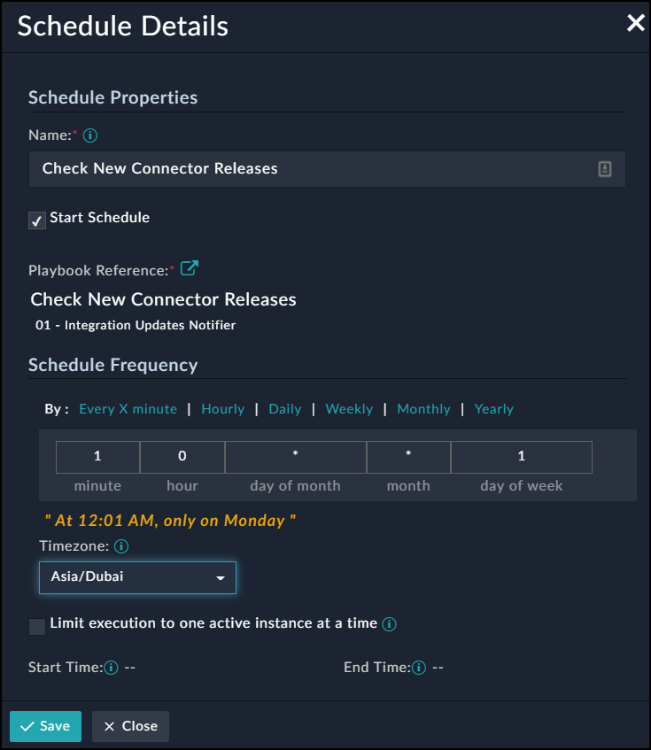
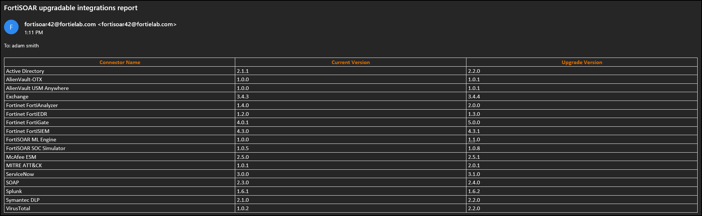

# solution-pack-connectors-updates-notifier

## Overview
Playbook to notify SOC admins via email about the availability of new connectors in FortiSOAR connector store

## Prerequisites:
- Internet connection (to retrieve the latest connectors data)
- Supports FortiSOAR 7.0.2+
- Make sure the global variables below are set properly (Open any playbook, and brose to **Tools -> Global Variables**): 
  - Server_fqhn: (host or IP address of FortiSOAR)
  - Default_Email: The recipient email address receiving the report
  
## Import:
- Download the solution pack zip file by clicking **Code -> Download ZIP** from this page
- Browse to FortiSOAR **Import Wizard** and import the pack. This will create a new playbook collection **01 - Integration Updates Notifier** in which you have the **Check New Connector Releases** playbook.

- Create a schedule for the above playbook to be sent daily or weekly:
  - In FortiSOAR, browse to **Automation > Schedules** click: **Create New Schedule**

- You should then receive an email which looks like:

